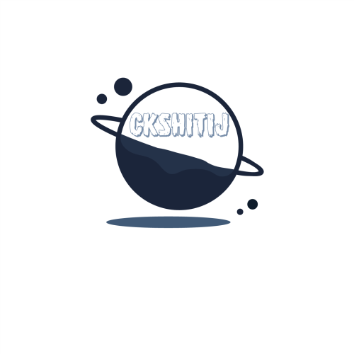

## CKSHITIJ 

Welcome to the project documents and technical blogs! Here, you'll find content written in markdown format while enjoying a polished and professional UI experience.  
This seamless combination of simplicity and style is made possible by **dosify**, enabling markdown content to be presented with a proper, visually appealing user interface.

## About Me

- I'm a Senior Software Engineer with 6 years of experience
- Proficient in developing backend services, libraries and SDKs.
- Hands-on experience in leading teams, delivering high-quality projects, and implementing efficient development processes.
- Excellent at troubleshooting, root cause analysis and problem-solving skills with attention to detail.

### Skills

**Programming Languages**: Golang, C++, Typescript, Python, Rust  
**Software Development**: RESTful APIs, PostgreSQL, Github, Microservices, Data Structures/Algorithm  
**Web3 Technologies**: NEAR Protocol, Blockchain (EVM compatible), Metamask, Opensea, Web3auth  
**Libraries/Frameworks**: Docker, Kubectl, RabbitMQ, Redis, NPM, GitHub Actions, MQTT, Swagger (OpenAPI)  
**Cloud Services**: Azure(KeyVault, Service Bus, CosmosDb)  
**Domains**: Storage, Blockchain, Ad-Tech, Machine-Learning (Supervised)  
**Other Skills**: Agile, JIRA, Git, Docker, CI/CD, Linux  
